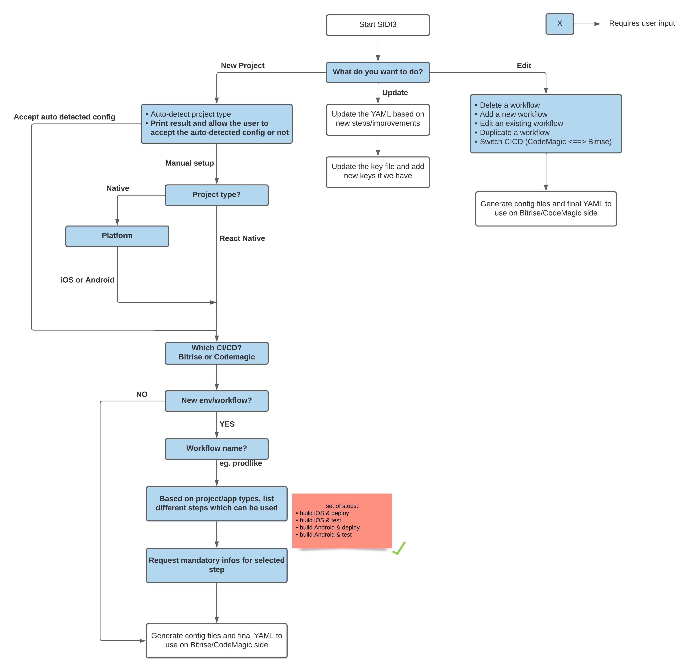

<p align="center">
  
</p>


# **SIDI-CLI**

**SIDI** is a user-friendly CLI tool designed to streamline the creation of YAML files for **testing**, **building**, and **deploying** mobile projects on **Bitrise** and **Codemagic**.

---

## 🚀 Getting Started

**SIDI** simplifies CI/CD setup by guiding you through the creation of optimized YAML configuration files.  
It ensures:
- **No duplicate steps**
- **Consistent workflows**
- Automatic injection of required keys and configurations.

With SIDI, you'll answer a few questions about your project and desired CI/CD setup, and it will do the heavy lifting for you!

---

## 🌟 Why Use SIDI?

Setting up a project from scratch on CI/CD platforms like Bitrise and Codemagic can be complex and time-consuming. Each platform uses unique workflows, making it harder to manage as the number of workflows grows.  

**SIDI** makes the process:
- **Easier**: Automates YAML file creation and updates.
- **Faster**: Generates optimized configurations tailored to your needs.
- **Flexible**: Enables seamless switching between Bitrise and Codemagic.

With SIDI, you can:
- Quickly create and configure YAML files.
- Update YAML configurations to the latest standards.
- Maintain consistency across CI/CD setups.

---

## 🛠️ How It Works

**SIDI** asks a series of questions about:
- **Project Details**:
  - Type: Native Android, Native iOS, or React Native.
  - Application or Library.
  - CI/CD platform: Bitrise or Codemagic.
- **Workflows**:
  - Workflow names.
  - Steps to include or exclude.

### Output Files:
1. **Main YAML File**: The core configuration for your CI/CD platform.
   - **Important**: This file should not be manually edited. Use `sidi-cli u` for updates.
   - For Bitrise, copy/paste the content into the platform. For Codemagic, push the file directly.
2. **Secret File**: Contains keys required for builds.
   - Fill in the required values to ensure a successful build.
   - Refer to the [purposed steps documentation](./docs/purposedSteps.md) for details.

---

## 🧩 Features

### Supported CI/CD Platforms
| CI/CD      | Status               |
|------------|----------------------|
| Bitrise    | ✅ Supported         |
| Codemagic  | ✅ Supported         |

### Supported Project Types
| Project Type    | Status               |
|-----------------|----------------------|
| React Native    | ✅ Supported         |
| Flutter    | 🛠️ WIP         |
| Native iOS      | ✅ Supported         |
| Native Android  | ✅ Supported         |

### End-to-End orchestrator extension

[(Working only with) End-to-End testing starter pack](https://github.com/arhs-spikeseed-mobile/sidi-cli-extension-end-to-end/tree/main/end-to-end)

[CI/CD configuration](./docs/end-to-end-setup.md)


| CI/CD      | Status               |
|------------|----------------------|
| Bitrise    | ❌ Unsupported       |
| Codemagic  | ✅ Supported         |


---

## 📥 Installation

Install **SIDI** using either `npm` or `yarn`:

```bash
yarn global add sidi-cli

# OR

npm install -g sidi-cli
```

---

## 🔧 Commands Overview

SIDI offers a variety of commands to suit your needs.  
For a detailed list of commands, refer to the [Commands Overview](./docs/commands.md).

### User Flows

<p align="center">
  
</p>

---

## 📋 Purposed Steps

When creating a workflow, **SIDI** groups steps based on:
- Project details.
- User inputs.

A complete list of these steps is available [here](./docs/purposedSteps.md).

---

## ❓ FAQ

#### 1. How do I add iOS certificates for archiving and exporting builds?
Find detailed instructions [here](./docs/iosCertificates.md).

#### 2. How do I set up an Android keystore for a workflow?
Follow the steps [here](./docs/androidSigning.md).

#### 3. How can I customize the push events that trigger workflows?
Learn more [here](./docs/buildTriggers.md).

---

## 📄 License

This project is licensed under the MIT License. See the LICENSE file for details.
