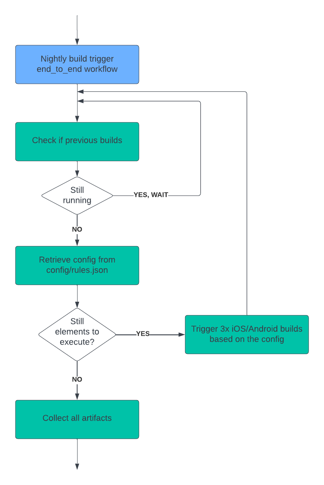

# 🌙 **Nightly Build Workflow Documentation**

## 📝 1. Overview of the Workflow

This document describes the **flow** for an end-to-end process. The workflow ensures that builds are executed efficiently, configurations are retrieved dynamically, and artifacts are collected upon completion.

## ⚙️ 2. Steps in the Process

### 🔹 Step 1: Nightly Build Trigger
- 🕒 The workflow is triggered nightly to initiate the **end-to-end workflow**.
- **Action:** The process begins execution automatically.

### 🔎 Step 2: Check if Previous Builds are Running
- 🔄 The system verifies if previous builds are still running.
- **Decision:**  
  - ✅ **YES:** Wait until the running builds complete.  
  - ❌ **NO:** Proceed to the next step.

### 📂 Step 3: Retrieve Configuration
- 🛠️ Configuration is retrieved from the file: **`config/rules.json`**.
- **Purpose:** This file contains the build rules and parameters.

### 🔄 Step 4: Still Elements to Execute?
- The system checks if there are still **elements to execute** based on the configuration.

- **Decision:**  
  - ✅ **YES:** Trigger builds for both **iOS/Android** platforms.  
      - 🔨 **Action:** 3 builds are triggered based on the configuration.  
  - ❌ **NO:** Proceed to collect all artifacts.

### 📦 Step 5: Collect All Artifacts
- 📥 All artifacts from completed builds are collected for further processing or storage.

## 🔁 3. Workflow Diagram
Refer to the **Nightly Build Workflow** diagram for a visual representation of the process.

## 📤 4. Summary
The nightly workflow ensures:
- ⏱️ Timely nightly triggers.  
- 🛠️ Configuration-based build execution.  
- 🚦 Safe handling of ongoing processes.  
- 📦 Collection of artifacts for analysis.
