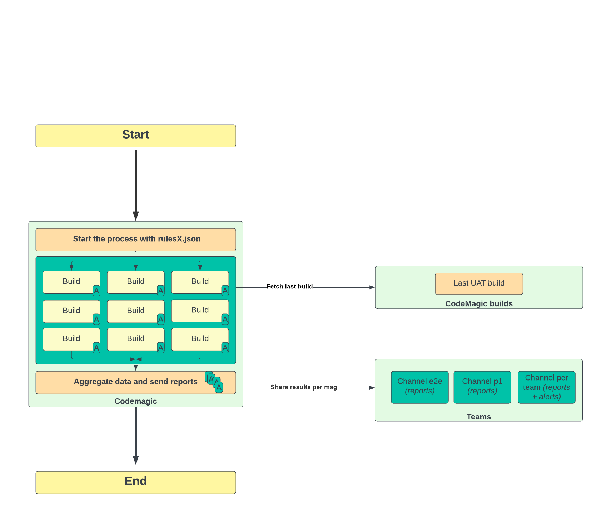

# 🚀 End-to-End Workflow Documentation

## 📝 1. Overview of the Workflow

This document describes an **automated workflow** designed to fetch, build, aggregate, and report data using **Codemagic** as the primary CI/CD platform. The workflow incorporates rules-based processing and includes notification and reporting to multiple **Teams communication channels**.

The process ensures the following:
- ✅ Builds are triggered as per defined rules.
- 📊 Aggregated reports and alerts are generated after processing.
- 📢 Results are shared across relevant communication channels.

## ⚙️ 2. Steps in the Process

### 🟢 Step 1: Start
- 🚦 The workflow begins execution with a predefined trigger or manual initiation.
- **Action:** The process starts by fetching `rulesX.json` as the input configuration file.

### 🔧 Step 2: Build Process (Codemagic)
Once the process is initiated, multiple builds are triggered in **parallel**.

- **🔨 Build Components:**
  - 🛠️ Build A, Build B, Build C, etc.
  - These builds are executed based on rules defined in `rulesX.json`.

- **📋 Details:**
  - Each build task runs independently.
  - Builds leverage Codemagic's CI/CD system for consistency and automation.

- **🔍 Fetch Last Build:**
  - The workflow fetches the **latest UAT build** from **Codemagic Builds**.
  - This ensures that the process is aligned with the most recent stable release.

### 📊 Step 3: Aggregate Data and Send Reports
Once all the build processes complete, the results are collected, aggregated, and prepared for reporting.

- **🔄 Aggregation Process:**
  - Data from all successful builds are consolidated.
  - Reports are formatted based on build outcomes.

- **📤 Output:**
  - Reports and alerts are generated for further communication.

### 📩 Step 4: Share Results per Message
Aggregated results and reports are shared to designated channels.

- **💬 Teams Notifications:**
  Reports are sent to the following communication channels:
  - 📨 **Channel e2e** – Dedicated for **end-to-end reports**.
  - 📨 **Channel P1** – Reserved for priority **P1-level reports**.
  - 📨 **Channel per team** – Team-specific **reports and alerts** for quick issue resolution.

## 📌 3. Key Workflow Diagram

