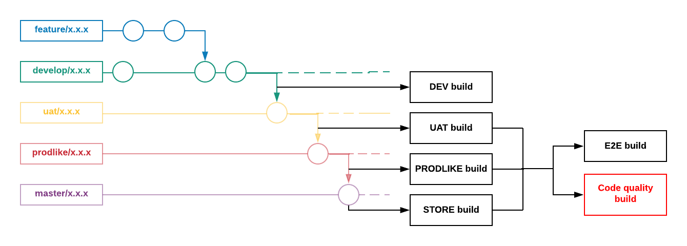
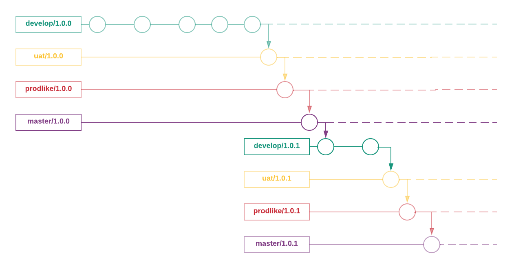

# 🌱 **Versioned Branching Strategy**

A consistent branching strategy is key for collaborative development, version control, and seamless CI/CD pipelines. This document explains a **versioned Git branching workflow** supported by images for clarity.

---

## 🌟 **Main Branches**

The workflow relies on five key branches:

1. **feature/x.x.x** – For feature development.
2. **develop/x.x.x** – Main development branch for integration.
3. **uat/x.x.x** – For User Acceptance Testing (UAT).
4. **prodlike/x.x.x** – Pre-production (PRODLIKE) environment for validation.
5. **master/x.x.x** – The production branch.

---

## 🏷️ **Branch Versioning**

Branch versioning follows **semantic versioning** (`x.y.z`):
- `x` = Major version (breaking changes)
- `y` = Minor version (new features)
- `z` = Patch (bug fixes)

---

## 🚀 **Workflow with Images**

### 1️⃣ **Feature Development**  

- All features are developed in **feature branches**.
- A `feature/x.x.x` branch is created from `develop/x.x.x` to isolate changes.  
- Once tested, the branch is merged back to `develop`.



---

### 2️⃣ **Multi-Version Support**  

In multi-version scenarios:  
- Features and fixes are applied to specific versions.
- Cherry-picking ensures that hotfixes and features propagate to the right branches.


---

### 3️⃣ **New Application Versions**  

When creating new versions:  
1. A new `develop/x.y.z` branch is started.  
2. Updates flow from `develop → uat → prodlike → master`.  
3. Tags ensure clear milestones.



---

## 🛠️ **Branch Naming Conventions**

Branches adhere to the following format:  

```
[type]/[version]/[task-id]/[description]
```

### **Examples:**
- `feat/1.0.1/TEAM-123/implement-login`
- `fix/1.0.2/BUG-456/resolve-api-error`

---

## 🔧 **Workflow Steps**

### 1. **Feature Development**  
   - Develop in `feature/x.x.x`.
   - Merge into `develop/x.x.x`.

### 2. **UAT Validation**  
   - From `develop/x.x.x`, create a `uat/x.x.x` branch for testing.

### 3. **Pre-Production**  
   - Merge UAT changes to `prodlike/x.x.x`.

### 4. **Release to Production**  
   - Final changes are merged into `master/x.x.x`.

---

## 🔍 **Benefits of this Workflow**

- **Clear isolation** of features and fixes.
- **Multi-version support** for production and upcoming releases.
- Simplifies tracking, testing, and deploying changes.

---
